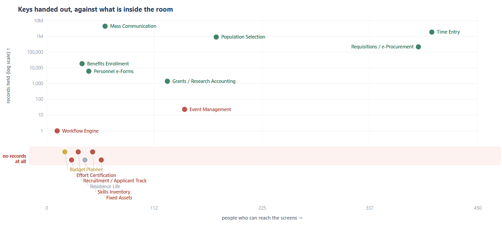

# Banner Capability Map

Find what your institution already owns in Banner, and does not use, from your own
read-only database. Built to answer purchase requests for things Banner already does.

**Nothing leaves your machine.** There is no service, no upload, no telemetry. The tool
connects to your own read-only Banner account, and the answers are written to files next
to it. The repository ships the method; the findings are yours and stay yours.



Every dot is one capability: how many people can open its screens, against how much it
holds. The strip along the bottom is the finding. Those are rooms with doors built and
keys handed out, where not one record has ever been written.

*Invented data from a college that does not exist. Generated by
[`docs/make_sample.py`](docs/make_sample.py), which you can run yourself: a screenshot
is a claim, and you should be able to check what it is a picture of.*

For every capability it asks Banner three questions, and none of them is a report:

1. **Do the screens exist?** (`GUBOBJS`) — proves the capability is installed.
2. **Can anyone reach them?** (`GUVUACC`) — the open door, not the traffic.
3. **Is there data, and recent?** (`COUNT` + activity date) — the judge.

`Forms exist + people hold the keys + zero data` = owned, wired up, never used.

## Run it

```
pip install oracledb python-dotenv openpyxl
cp .env.example .env        # then fill in your read-only Banner connection
python bcm_report.py --out capability_map.xlsx --html capability_map.html
```

It writes a spreadsheet and a self-contained interactive page. Click any capability and
its screens, tables, records and users fill the panel. Nothing leaves your machine, and
every statement is a SELECT.

Set `BCM_SERVICE_ACCOUNT_PREFIX` in `.env` to the prefix your non-human Banner accounts
share. Left empty, service accounts are counted as people and every "can reach it"
number runs high.

## What the report shows

**The chart.** Every capability plotted as people-who-can-reach-it against
records-held. The strip along the bottom is the finding: rooms with doors built and
keys handed out where not one record has ever been written.

**The group layer.** For each capability, which security **group** or **class** opens
it, how many of its screens each one reaches, how many of those it can **change**, and
how many people hold it. Banner names groups after the job ("Admissions Manager"), which
is what makes this readable to a director rather than to a DBA.

It reports a **headcount and never a name**. That is a deliberate design choice: the
group is the unit you can actually govern, and a per-person listing is a different
review with different rules. Say so out loud when you present it.

**Access debt.** Flagged when a capability holds no live data *and* a group still grants
the right to change it. Nothing is misconfigured; it is standing permission on a room
nobody enters. Usually the cheapest cleanup on the page, because removing it takes
nothing away from anyone who is working.

**A link per capability.** `capability_map.html#fixed-assets` opens the file on that
card, so one finding can be sent on its own.

## History: what moved

Banner's security tables carry **no history**. A revoked grant is deleted, not
end-dated, so "who could reach this last March" cannot be reconstructed after the fact,
by any query, ever. (Record counts can be approximated from activity dates; access
cannot. Both directions of error, no way to bound them.)

So the tool keeps its own. Each run appends a small JSON snapshot to `history/`:

```
python bcm_report.py --runs                          # runs stored so far
python bcm_report.py --since 2026-03-02 --out ...    # today, compared to that date
python bcm_report.py --compare 2026-03-02 2026-08-05 # two stored runs, NO database
python bcm_report.py --snapshot-only                 # measure and store, write nothing
```

Once a second run exists, the report opens with a **what moved since** band, each card
carries its own changes, and the workbook gains a *Since last run* sheet.

`--compare` reads two files and never connects to Banner, so it runs off-network, in a
meeting, in a second.

Two things worth knowing:

- **Compare before saving.** The tool does this already. Save first and a run becomes
  its own baseline and can never show change.
- **The history is the one thing that cannot be regenerated.** Do not prune it. A
  snapshot is about 20 KB; keeping every weekly run forever is a rounding error.

If you schedule it (weekly is a good default), point `--history` at durable storage.
On an ephemeral worker, subclass `HistoryStore` (three methods: `list`, `read`, `write`)
and assign `bcm_report.STORE`. Written to local disk on a container, the feature dies
silently: no error, just one run forever.

## The one rule that keeps it honest

**Empty is not the same as unlicensed.** A capability nobody ever paid for would also be
empty. This measures **use**, not entitlement. Before telling a department "you already
own this", confirm it is in your current Ellucian license. The tool shows the door and
the traffic; the contract is a separate question.

## Files

- `bcm_report.py` — the tool.
- `.env.example` — connection template.
- `capability-map-guide.html` — the method explained, with the SQL, for anyone who wants
  to understand or extend it.

The catalogue of capabilities in the script is a starting set of the ones institutions
most often license and under-use. Add your own: each entry is a form prefix and a
canonical table. The verdicts are computed from **your** data, so they are yours alone.

## A word on what you commit

`.gitignore` excludes the generated `.xlsx`, `.html` and the `history/` folder on
purpose. Those files are your institution's audit findings: which modules you own and
do not use, and how many people hold the right to change them. Useful internally,
nobody else's business. Keep them off any remote you do not fully control.

## License and author

MIT. Built by **Pedro Hernández**.

Issues and pull requests welcome, particularly new catalogue entries: if you find a
capability worth measuring at your institution, it is probably worth measuring at
everyone's. Please do not include your own findings in the issue.
